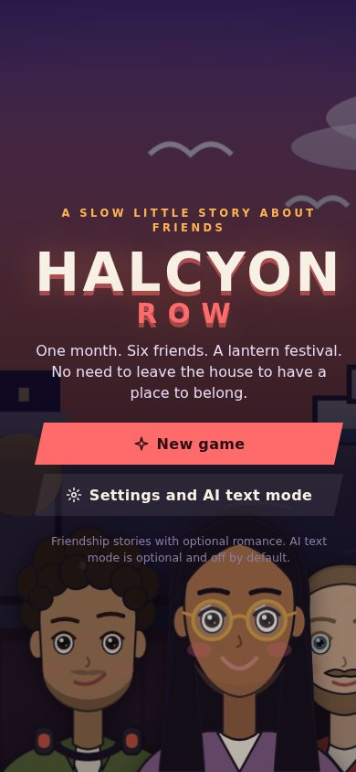
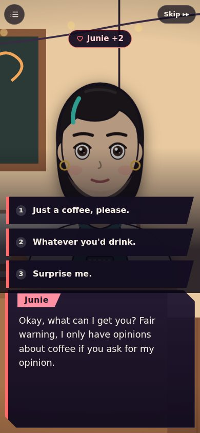
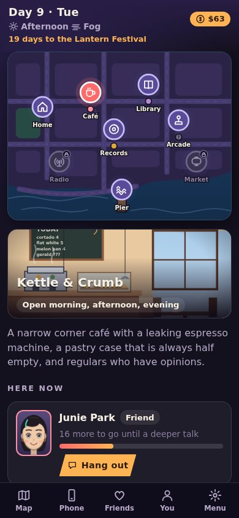
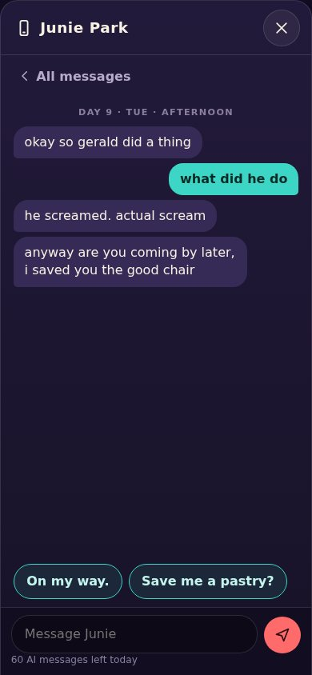
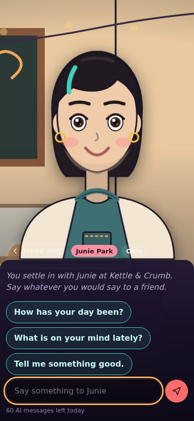

# Halcyon Row

A cozy city where the friends are real enough to miss.

Halcyon Row is a social sim in the spirit of Persona's confidants: one month in a small harbor neighborhood, six people who become your friends, a calendar with four time slots a day, and a lantern festival on day 28. You never have to leave the house. The city comes to you, on your phone or your desktop, and it works offline.

<p align="center">
  
  
  
  
  
</p>

## Play

You need Node 20.3 or newer only for the optional local server. The game itself is plain files.

```sh
node server/serve.mjs          # then open http://localhost:8080
```

Any static file server works too (`python3 -m http.server`), but only `server/serve.mjs` can keep your AI keys off the browser and reach an OpenCode server from your phone.

**On a phone.** Two routes:

1. Host the files anywhere over https (the repo includes a GitHub Pages workflow, see Deploy) and open the address on your phone. Use the browser's Add to Home Screen. It installs like an app and runs offline.
2. On your own Wi-Fi run `node server/serve.mjs --lan`. It prints a link for your phone that includes a private access token.

## How it plays

- **Time.** 28 days, four slots each: morning, afternoon, evening, night. Tapping a place on the map is free. Anything you do there spends a slot.
- **Friends.** Each has a weekly routine, so who is around depends on the day and the hour. The map shows who is where, and a heart appears when someone has something to say.
- **Bonds.** Five ranks per friend. A deeper scene needs enough points and the right time and place. Hangouts, well chosen replies, small gifts and texts all count, and each has a daily limit so you cannot grind one friend.
- **You.** Charm, Wit, Grit and Empathy grow through jobs and habits. Higher stats open better things to say.
- **Phone.** Friends text you on their own. Nobody is punished for being slow to answer, and a thread simply waits.
- **Trade offs.** You cannot get to know everyone completely by the festival. The month afterward is playable, with one more scene for each friend.

The six friends: Junie (café), Dez (record shop), Priya (library and tide flats), Tomek (night market noodles), Sable (street artist), Amara (the overnight radio host).

### Friendship first, romance optional

Every friendship stands on its own. Four of the six can also grow into something romantic if you turn that on in **Menu, Game** (adults only, off by default, gentle and non explicit). Tomek and Sable are friendship only by design. Nothing about the main story depends on romance.

## AI text mode

Story mode is fully scripted and needs no network. AI text mode is optional and off by default. Once it is set up you get:

- a typing box in every phone thread, where the friend answers in character, and
- **Chat freely** on any friend you are standing next to, an in person conversation that costs one time slot.

Replies use each friend's written voice, what you have actually been through together, the time and weather, and what they would honestly know at that point in the friendship. Locked secrets are never put in the prompt, so they cannot leak early.

### Providers

Open **Menu, AI text mode**. Pick a provider and connect it one of two ways.

| Provider | What you need |
| --- | --- |
| **ChatGPT models (OpenAI)** | An OpenAI API key. The ChatGPT app and website have no public connection, and API use is billed separately from a ChatGPT subscription. The same option works with OpenRouter, Ollama, LM Studio and anything else that speaks the Chat Completions protocol: change the base URL. |
| **OpenCode** | Run `opencode serve`. OpenCode can sign in with a **ChatGPT Plus or Pro plan** (use `/connect`, choose OpenAI, then ChatGPT Plus/Pro) or with many other providers, so this is the way to use a subscription instead of an API key. |

Model names are never hard coded. **Load models** asks the service what it offers, so the list is always current.

**Directly from this browser** is the simplest. The key is stored on this device only, in your browser's local storage. For OpenCode, start it with `--cors` and the address you play from:

```sh
opencode serve --port 4096 --cors http://localhost:8080
```

**Through the game server** keeps secrets out of the browser altogether and is the only way for a phone to reach OpenCode on your computer (an https page cannot call a plain http address on your network). Put credentials in the environment when you start it:

```sh
OPENAI_API_KEY=sk-... node server/serve.mjs
OPENCODE_SERVER_PASSWORD=... node server/serve.mjs --lan   # if your OpenCode has a password
```

| Variable | Meaning |
| --- | --- |
| `OPENAI_API_KEY` | Key for the OpenAI compatible service |
| `OPENAI_BASE_URL` | Default `https://api.openai.com/v1`. Point at Ollama, OpenRouter and so on |
| `OPENCODE_URL` | Default `http://127.0.0.1:4096` |
| `OPENCODE_SERVER_USERNAME`, `OPENCODE_SERVER_PASSWORD` | If your OpenCode server has a password |
| `GAME_TOKEN` | Optional shared secret for `/api/ai/*`. Made up for you with `--lan` |

For the most natural OpenCode chat, copy the `halcyon` agent from `server/opencode.example.json` into your `opencode.json` and type `halcyon` in the Agent box. OpenCode is a coding agent by default, and this agent gives it a plain conversational job with tools switched off.

### What it costs and what it shares

- A cap on AI replies per in game day (default 60) keeps a long session from running up a bill.
- Each request contains your message, recent turns, and a description of the friend and your history with them. Nothing else about you leaves the device. Story mode sends nothing at all.
- Exported save files never contain keys. Keys live under a separate storage entry.

### How the friends are told to behave

Every prompt includes rules that override the rest: a friend answers honestly if you sincerely ask whether they are an AI, never guilt trips or gets possessive when you leave, points you to real people and local help if you ever say you are in danger, keeps romance opt in and PG-13, and avoids sexual content. Replies are also cleaned up so the hidden mood and bond tag never shows and dashes become commas.

Models can and do break rules sometimes. These instructions reduce that; they do not guarantee it.

## A note on the idea

A game about having friends without leaving home walks a line. The design leans on things that do not fight your real life: days end, friends have their own routines and lives, being away costs you nothing, they nudge you toward sleep and other people now and then (switchable), and an AI friend will tell you what it is if you ask. If the game is ever a way of avoiding people you would like to know, that is worth noticing.

## Make it your own

**Replace the story.** The whole main plot is `js/data/story.js`, a list of beats that fire on a given day and time slot. Edit or swap them. Friends' own scenes live in `js/data/scenes/` and do not need to change.

**Write scenes.** Scenes are arrays built with a tiny helper set from `js/core/dsl.js`:

```js
const J = voice('junie');
[
  bg('cafe'),
  J('happy', 'You came back.'),
  choice([
    opt('Obviously.', [J('smirk', 'Good answer.')], { pts: ['junie', 2] }),
    opt('Is that a problem?', [J('surprised', 'No! God, no.')], { pts: ['junie', 1] }),
    opt('(Slide her a pastry.)', [], { req: { stat: ['empathy', 2] }, pts: ['junie', 3] }),
  ]),
]
```

Options can require a stat, a rank or a flag, and can be hidden unless a condition holds. Moods are `neutral happy laugh smirk sad worried surprised annoyed blush thinking sleepy serious`.

**Add a friend.** Copy a file in `js/data/characters/`, give them a `look`, a weekly `schedule`, a `voice bible` under `ai`, and a scenes file, then list them in `characters/index.js`. The content tests check that everything referenced exists and every scene can be reached.

**Writing style.** The tests enforce one rule on all dialogue: no em dashes, en dashes or spaced hyphens. It makes the friends sound like people typing.

## Project layout

```
index.html  manifest.webmanifest  sw.js  precache.json      the app shell
css/                                                        styles
js/core/     clock, bonds, script runner, saves, phone       no DOM, fully tested
js/data/     characters, scenes, places, items, story        all the content
js/art/      SVG portraits and backdrops                     no image files
js/ui/       screens: title, hub, map, scene, phone, ...
js/ai/       prompt builder, reply parser, provider adapters
server/      serve.mjs (static files and the key holding proxy)
tests/       unit tests, mock AI servers, browser check
tools/       precache builder, icon maker, pacing simulator
dev/         portrait and backdrop lab pages
```

## Develop

```sh
npm test                       # unit and content tests, no browser needed
npm run precache               # rebuild precache.json after changing any game file
node tools/sim.mjs --skill 0.6 # play a whole month with a bot to check pacing
NODE_PATH=$(npm root -g) node tests/e2e/smoke.mjs   # browser check (needs Playwright)
```

`dev/portraits.html` and `dev/backdrops.html` show every face and place while you tweak the art.

## Deploy

`.github/workflows/pages.yml` runs the tests and, on pushes to `main`, publishes only the game files to GitHub Pages. Turn it on once under **Settings, Pages, Build and deployment, Source: GitHub Actions**.

## Status

The engine, content, interface, offline mode, local server and AI adapters are tested: unit and content tests, mock OpenAI and OpenCode servers (including awkward model behavior), and a real browser run through the mock providers. A whole month has been played by simulation bots using the real game code, and the opening scenes and the festival ending were played through in a real browser.

What has **not** been exercised: a live OpenAI account and a live OpenCode server. Those were built to their documented APIs and tested against mocks, because the development environment could not reach them. If something behaves differently for you, the error message in the settings screen will say what the service answered.

The story is a placeholder on purpose. The friendships are the point.
